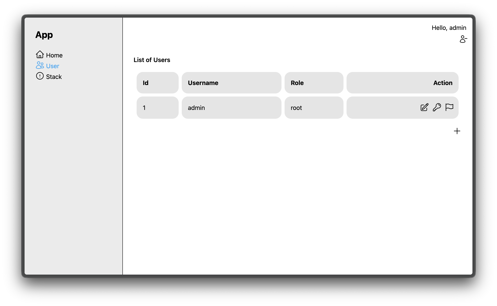
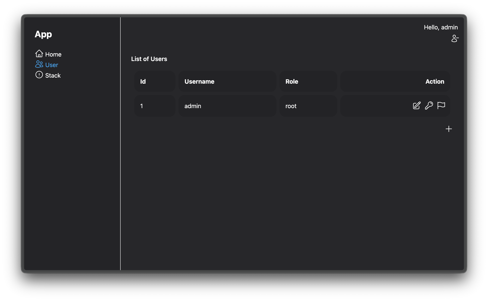

# Poem Web Template Base (Rev-01)

Template for poem web.

## Features

* Poem Web Framework
    * https://github.com/poem-web/poem
* Maud
    * https://maud.lambda.xyz/
* Htmx
    * http://htmx.org/
* Rusqlite
    * https://github.com/rusqlite/rusqlite
* My Very Own CjToolkit Structured Validator
    * https://github.com/cjtoolkit/cjtoolkit-structured-validator
* Rust Embed
    * https://pyrossh.dev/repos/rust-embed
* TailwindCSS
    * https://tailwindcss.com/

## Usage

To use the template, clone this repository with cargo generate.

```sh
cargo generate --git https://github.com/cj-template/poem-web-rev-01
```

It will generate a project with the readme and images removed.

## To Run

Just run `./run.sh` and open `http://localhost:8000` for public or `http://localhost:8001` for
backoffice in your browser.

## Note

If you name the project `my-awesome-project`, the project will be generated in `my-awesome-project`.

Also, the following will be:

Config file: `my-awesome-project.toml`  
Local config file: `my-awesome-project.local.toml` will be ignored by git.  
Config override environment variables: `MY_AWESOME_PROJECT_CONFIG_PATH`

### Default Credentails for Backoffice

```
username: admin
password: banana
```

## Screenshots

### Public


### Backoffice




* Template can be adjusted to your needs.